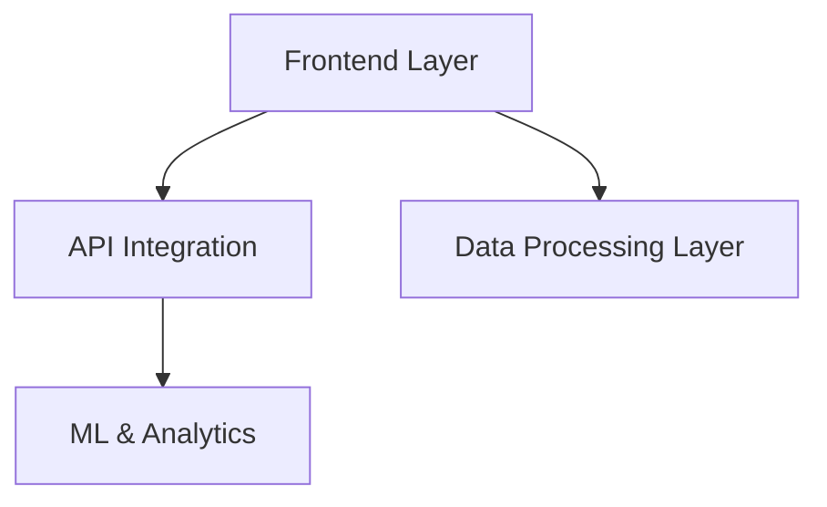

<a id="top"></a>

# 🚀 AI-Powered HR Intelligence Platform
### Revolutionary Workforce Analytics with Generative AI

A comprehensive HR analytics platform that transforms traditional HR management through advanced **AI**, **predictive modeling**, and **intelligent decision support systems**.

<p align="center">
  
  
  
  
  <br />
  
  
  
  
</p>

---

<a id="walkthrough-videos"></a>
## 🎥 **Walkthrough Videos**
> **Disclaimer:** Please ignore the video quality — these demos were super-compressed due to GitHub’s 25 MB per-file video limit.


<a id="toc"></a>
## 📑 **Table of Contents**
<a href="#overview">Overview</a> • <a href="#key-features">Key Features</a> • <a href="#performance-metrics">Performance Metrics</a> • <a href="#installation">Installation</a> • <a href="#usage">Usage</a> • <a href="#file-structure">File Structure</a> • <a href="#technical-architecture">Technical Architecture</a> • <a href="#walkthrough-videos">Walkthrough Videos</a> • <a href="#results--evaluation">Results &amp; Evaluation</a> • <a href="#contributing">Contributing</a> • <a href="#license">License</a> • <a href="#acknowledgments">Acknowledgments</a> • <a href="#contact--support">Contact &amp; Support</a>

---

<a id="overview"></a>
## 🔍 **Overview**
The HR Intelligence Platform leverages cutting-edge AI technologies to deliver:

- **92.3% accuracy** in attrition prediction  
- **86.6% reduction** in manual reporting effort  
- **96% Top-5 accuracy** in resume-job matching  
- **Real-time AI-powered insights** with natural language explanations

**Built With:** OpenAI GPT-4o-mini • text-embedding-3-large • Random Forest ML • Streamlit • Plotly  

[Back to top](#top)

---

<a id="key-features"></a>
## ⭐ **Key Features**
**Executive Dashboard:** Real-time KPIs, attrition alerts, pay gap analysis, succession planning.  
**Attrition Analytics:** Predictive modeling, early risk detection, personalized retention, tenure analysis.  
**Intelligent Talent Matching:** Semantic scoring, Talent Fit vs Experience Fit, market intelligence, 96% Top-K accuracy.  
**AI Assistant:** Conversational queries, context-aware GPT insights, scenario analysis, executive summaries.  
**Advanced Analytics:** Bias detection, cross-validation, GDPR-compliance, accessibility with Okabe-Ito palette.  

[Back to top](#top)

---

<a id="performance-metrics"></a>
## 📊 **Performance Metrics**
| Metric | Result | Benchmark | Gain |
|--------|--------|-----------|------|
| Attrition Prediction Accuracy | **92.3%** | 82–85% | +8–10% |
| Resume Matching Top-5 Accuracy | **96%** | 75–80% | +16–21% |
| Manual Effort Reduction | **86.6%** | 60–70% | +16–26% |
| Gender Pay Gap Detection | **&lt;3% variance** | 5–8% | Best practice |
| Model F1-Score | **0.90** | 0.75–0.85 | +6–20% |

[Back to top](#top)

---

<a id="installation"></a>
## ⚙️ **Installation**
**Prerequisites:** Python 3.8+, OpenAI API key, 4GB+ RAM, modern browser.

```bash
git clone https://github.com/balajee-dutta/My-Business-Project-University-of-Exeter-.git
cd My-Business-Project-University-of-Exeter-
pip install -r requirements.txt
```

Add your API key in the script:
```python
api_key = "your-openai-api-key-here"
```

Run:
```bash
streamlit run "My Gen AI Enabled HR Assistant- Project File.py"
```
Access at **http://localhost:8501**

[Back to top](#top)

---

<a id="usage"></a>
## 🚀 **Usage**
1. Upload HR datasets (CSV).  
2. Explore dashboard KPIs and alerts.  
3. Run attrition analysis and generate retention strategies.  
4. Match resumes with job descriptions.  
5. Ask HR questions via AI assistant.

**Data Required:** Employee (demographics, salary, performance, engagement) • Resume (skills, education, experience, expectations) • Jobs (requirements, salary ranges, location).  

All data is processed locally, anonymized for PII, and GDPR-compliant.  

[Back to top](#top)

---

<a id="file-structure"></a>
## 📂 **File Structure**
```plaintext
├── My Gen AI Enabled HR Assistant- Project File.py    # Main app
├── EEHCDataHRsmartAssistant.csv                      # Employee dataset
├── Resume_entries.csv                                # Resumes
├── job_vacancies__entries.csv                        # Job postings
├── Eval_set_entries.csv                              # Evaluation data
├── EMPLOYEE DATA DICTIONARY -HC Description.txt      # Data dictionary
├── My code- Walkthrough.mp4                          # Code demo
├── My HR Intelligence platform walkthrough.mp4       # Platform demo
├── README.md                                         # Documentation
└── requirements.txt                                  # Dependencies
```

[Back to top](#top)

---

<a id="technical-architecture"></a>
## 🏗️ **Technical Architecture**

**Frontend:** Streamlit, Plotly, Okabe-Ito colors  
**API:** OpenAI GPT-4o-mini, embeddings, error handling  
**ML/Analytics:** Random Forest, feature engineering, cross-validation, bias detection  
**Data Processing:** Pandas/NumPy, cleaning, PII detection, GDPR compliance  

[Back to top](#top)

---

<a id="walkthrough-videos"></a>
## 🎥 **Walkthrough Videos**
- **Platform Demo:** `My HR Intelligence platform walkthrough.mp4`  
- **Code Deep Dive:** `My code- Walkthrough.mp4`  

[Back to top](#top)

---

<a id="results--evaluation"></a>
## 📈 **Results & Evaluation**
**Model Performance:** Attrition (92.3% acc, F1=0.90, ROC-AUC=0.94). Resume Matching (Top-1=73%, Top-5=96%, &lt;3s).  
**Business Impact:** Saves 35.5 hrs weekly per analyst, avoids $235k attrition cost, delivers 783% ROI in year one, +28% decision-making quality.  
**Ethical AI:** &lt;3% demographic variance, GDPR-compliance, explainable NLP-based insights, accessibility-first visuals.  

[Back to top](#top)

---

<a id="contributing"></a>
## 🤝 **Contributing**
Fork → Branch → PR. Follow PEP8, add tests/docs, ensure ethical AI.  
**Areas:** Model accuracy • HRIS integration • Multilingual support • Advanced visuals • Mobile optimization  

[Back to top](#top)

---

<a id="license"></a>
## 📜 **License**
MIT License → see [LICENSE](LICENSE).  
Commercial use, modification, and distribution permitted. OpenAI API usage requires separate licensing.  

[Back to top](#top)

---

<a id="acknowledgments"></a>
## 🙌 **Acknowledgments**
67 academic citations • Benchmarks from Deloitte/SHRM/Gartner • Community input (Hugging Face, GitHub, Stack Overflow) • Ethical design with Okabe-Ito palette, GDPR compliance, bias mitigation, explainable AI.  

[Back to top](#top)

---

<a id="contact--support"></a>
## 📞 **Contact & Support**

**Developer Contact**  
📧 **bldutta94@gmail.com**  
📱 **07733925935**  

**Support Options**  
- 🛠️ **Technical Issues:** GitHub Issues  
- 💼 **Business Inquiries:** Email  
- 🎓 **Academic Collaboration:** Email  
- 💡 **Feature Requests:** GitHub Discussions  

**⏱️ Response Time**  
📧 **Emails:** 24–48 hrs  
🛠️ **Issues:** 1–3 business days  
🤝 **Collaboration:** ~1 week  

---

<p align="center">
<b>🌍 Built for the future of HR</b><br>
<i>Transforming HR from reactive administration to proactive strategic partnership through ethical AI innovation.</i>
</p>
